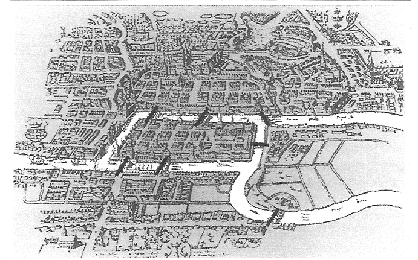
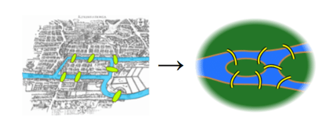
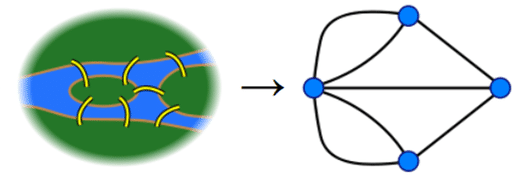

---
jupyter:
  jupytext:
    text_representation:
      extension: .md
      format_name: markdown
      format_version: '1.3'
      jupytext_version: 1.13.8
  kernelspec:
    display_name: Python 3
    name: python3
---

<!-- #region id="i-92gMF2dsgF" -->
# **Euler's Algorithm**
<!-- #endregion -->

<!-- #region id="1Jly-15HS1NL" -->

In this tutorial, we will explore the Euler's algorithm and its implementation in NetworkX under `networkx/algorithms/euler.py`.
<!-- #endregion -->

<!-- #region id="W4oRTaPEhhAU" -->

## **Seven Bridges of Königsberg**
<!-- #endregion -->

<!-- #region id="AxM3uBAZe9cX" -->
What you are seeing below is the beautiful old town of Königsberg which is famous for its seven bridges. Each of these bridges either connect two large islands—Kneiphof and Lomse or two mainland portions of the city.

<!-- #endregion -->

<!-- #region id="Wfsc2nP60NSp" -->

<!-- #endregion -->

<!-- #region id="g72kZOqUiRmL" -->
What gave the town its fame is a question that was asked to mathematician Leonhard Euler almost 300 years ago:

> ***Can you take a walk through the Königsberg visiting each land part of it by crossing each bridge once and only once?***

Euler's negative resolution to this question laid the foundations of graph theory. Before diving into Euler's solution, let's reformulate the problem.
<!-- #endregion -->

<!-- #region id="a4728aiWjeDM" -->
### **Reformulating the Problem in Abstract Terms**
<!-- #endregion -->

<!-- #region id="oEB55JLl0Unx" -->
In order to have a clear look, we should first simplify the map a little.
<!-- #endregion -->

<!-- #region id="9FhWLnEC0YYD" -->

<!-- #endregion -->

<!-- #region id="RdAXIb8b0eHn" -->
Euler observed that the choice of route inside each land mass is irrelevant. The only thing that matters is the sequence of bridges to be crossed in order. This observation allows us to abstract the problem even more. In the below graph, blue vertices represent the land masses and edges represent the bridges that connect them.
<!-- #endregion -->

<!-- #region id="2-C7-GbM0f8T" -->

<!-- #endregion -->

<!-- #region id="4k2f3eGDJTTZ" -->
Based on this abstraction, we can paraphrase the problem as follows:

> ***Can you draw the above graph without lifting your pen or crossing on a line more than once?***

If you can, it means there is an ***Euler Path*** in the graph. If this path starts and ends at the same blue circle, it is called an ***Euler Circuit***. 

Note that every Euler Circuit is also an Euler Path.
<!-- #endregion -->

<!-- #region id="8iEYRZjUOrBc" -->
### **Euler's Method**
<!-- #endregion -->

<!-- #region id="cZgO0JpY0p78" -->
Euler denoted land masses of the town by capital letters $A$, $B$, $C$ and $D$ and bridges by lowercase $a$, $b$, $c$, $d$, $e$, $f$ and $g$.
<!-- #endregion -->

<!-- #region id="z_6ynew30q43" -->

<!-- #endregion -->

<!-- #region id="LLtVy0LvYSCi" -->
He described his logic as follows:
- If we cross bridge $a$, we walk from $A$ to $B$. In this case, our travel route is denoted as $AB$. 
- If we cross first $a$ and then $f$, our route will be $ABD$.
- So, sequential use of $n$ bridges is denoted with $n+1$ capital letters.
- Since we need to cross each of 7 bridges, our route should consist of a sequence of $A$, $B$, $C$ and $D$ of length 8.

He also stated the fact that number of appearences of each land mass in the route depend on the number of bridges it has.
- $A$ has 5 bridges. All these 5 bridges should appear in our Euler Path exactly once. Then, $A$ should appear in our route for 3 times.
- $B$ has 3 bridges. It should appear in the route for 2 times.
- $C$ has 3 bridges. It should appear in the route for 2 times.
- $D$ has 3 bridges. It should appear in the route for 2 times.
- Then, total length of the route should be 3 + 2 + 2 + 2 = 9.

It is obvious that we cannot satisfy both of these conditions at the same time. Therefore, Euler concluded that there is no solution to Seven Bridges of Königsberg problem (I.e. Königsberg does not have an Euler Path). 
<!-- #endregion -->

<!-- #region id="dOgKxxjHhGuP" -->
### **Generalizing Euler's Solution**
<!-- #endregion -->

<!-- #region id="OpaOlWK8hL9H" -->
Euler generalized the method he applied for Königsberg problem as follows:

> ***A graph has an Euler Path if and only if the number of vertices with odd degree must be either zero or two.***

- If there are two vertices with odd degree, then they are the starting and ending vertices.
- If there are no vertices with odd degree, any vertex can be starting or ending vertex and the graph has also an Euler Circuit.
<!-- #endregion -->

<!-- #region id="ffSQYe1Cj9et" -->
## **NetworkX Implementation of Euler's Algorithm**
<!-- #endregion -->

<!-- #region id="ne_lPsankWsW" -->
NetworkX implemented several methods using the Euler's algorithm. These are:
- **is_eulerian**      : Whether the graph has an Eulerian circuit
- **eulerian_circuit** : Sequence of edges of an Eulerian circuit in the graph.
- **eulerize**         : Transforms a graph into an Eulerian graph
- **is_semieulerian**  : Whether the graph has an Eulerian path but not an Eulerian circuit.
- **has_eulerian_path**: Whether the graph has an Eulerian path.
- **eulerian_path**    : Sequence of edges of in Eulerian path in the graph.

In this part, we will briefly explain the NetworkX implementation of Euler's algorithm by explaining some of these methods.

**Note**: NetworkX implementation does not allow graphs with isolated nodes to have Eulerian Path and/or Eulerian Circuit. Thus, an Eulerian Path or Eulerian Circuit must visit not only all edges but also all vertices of the graph.
<!-- #endregion -->

<!-- #region id="ycKexNZnmZp2" -->
### **1. Eulerian Circuit Implementation**
<!-- #endregion -->

<!-- #region id="VIOHmRY_pG9D" -->
Implementation of `is_eulerian` method is quite simple. In order to have an Euler circuit (i.e. to be Eulerian):
- A directed graph must be strongly connected and every vertex of it must have equal in degree and out degree.
- An undirected graph must be connected and it must have no vertices of odd degree.

Here is an example:
<!-- #endregion -->

```python id="ru5RJiG4vYDq" colab={"base_uri": "https://localhost:8080/", "height": 319} outputId="4a0ddf49-3389-4ce8-be95-75777e453dcf"
import networkx as nx
G = nx.Graph([(0, 1), (0, 2), (0, 3), (0, 4), (1, 2), (2, 3), (2, 4)])
nx.draw(G, with_labels=True, node_size = 1000, font_color = "White", node_color="darkorange")
```

```python id="wQ8F1KBOr44Z"
def is_eulerian(G):
  if G.is_directed():
      return(all(
          G.in_degree(n) == G.out_degree(n) for n in G
      ) and nx.is_strongly_connected(G))
  else:
    return(all(d % 2 == 0 for v, d in G.degree()) and nx.is_connected(G))
```

```python colab={"base_uri": "https://localhost:8080/"} id="XDBRq3dOkzuR" outputId="86a18e3e-8571-4b39-b880-007b2cbfb055"
is_eulerian(G)
```

<!-- #region id="cUFPP731tETH" -->
NetworkX is also implemented `eulerian_circuit` method to determine sequence of edges that consist of a Euler Circuit. 

The method uses a stack data structure to keep vertices, it starts with the source vertex and pushes into stack. At each following iteration, it pops a vertex from the stack, chooses a neighbor of it, pushes the chosen vertex to the stack and removes the chosen edge from the graph.
<!-- #endregion -->

```python id="j7L5_zS7t0hA"
circuit = []

if G.is_directed():
    degree = G.out_degree
    edges = G.out_edges
else:
    degree = G.degree
    edges = G.edges

vertex_stack = [0]
last_vertex = None
while vertex_stack: 
    current_vertex = vertex_stack[-1]
    circuit.append(current_vertex)
    if G.degree(current_vertex) == 0:
      if last_vertex is not None:
          break
      last_vertex = current_vertex
      vertex_stack.pop()
    else:
        _, next_vertex = next(iter(G.edges(current_vertex)))
        vertex_stack.append(next_vertex)
        G.remove_edge(current_vertex, next_vertex)
```

```python id="BJ1xpyfNymtk" colab={"base_uri": "https://localhost:8080/"} outputId="5d6d9ef9-cb94-4658-d043-1e3134be6bfc"
print("-> ".join(list(map(str,circuit))))
```

<!-- #region id="I_pwuXa_mQJY" -->
### **2. Eulerian Path Implementation**
<!-- #endregion -->

<!-- #region id="X8H-GT3JqUwk" -->
Networkx implementation of `has_eulerian_path` first checks if the graph `is_eulerian` or not. Remember that if a graph is Eulerian (i.e. has Euler Circuit), then it also has Eulerian Path.

<!-- #endregion -->

```python id="iuUz3O9qWvgB"
def has_eulerian_path(G, source=None):
  if nx.is_eulerian(G):
      return True
```

<!-- #region id="eLNvmeFdW75x" -->
If an undirected graph is not Eulerian, it can still be `semi_eulerian` meaning that it might have an Eulerian Path with different starting and ending vertices. As explained above, this is possible if and only if
- there are exactly two vertices of odd degree, and
- all of its vertices belong to a single connected component.


If source vertex is given by the user, it must have an odd degree. Otherwise, there cannot be an Eulerian Path starting from the given source.
<!-- #endregion -->

```python id="VFfGgN-1qlZ_" colab={"base_uri": "https://localhost:8080/", "height": 130} outputId="0299072c-6fbe-4cbc-b42c-d1f927885d3e"
  if G.is_directed() == False:
    if source is not None and G.degree[source] % 2 != 1:
      return False
    return(sum(d % 2 == 1 for v, d in G.degree()) == 2 and nx.is_connected(G))
```

<!-- #region id="hDN2WSX2YFgG" -->
For a directed graph to has an Eulerian Path, it must have 
- at most one vertex has out_degree - in_degree = 1,
- at most one vertex has in_degree - out_degree = 1,
- every other vertex has equal in_degree and out_degree, and 
- all of its vertices belong to a single connected component of the underlying undirected graph *(I.e. Should be weakly connected)*.
<!-- #endregion -->

```python id="kn8dLkeIX0RX" colab={"base_uri": "https://localhost:8080/", "height": 130} outputId="3ecd4d8d-904c-457a-abe9-9f4f08f9eb5e"
  if G.is_directed():
      ins = G.in_degree
      outs = G.out_degree
      if source is not None and outs[source] - ins[source] != 1:
          return False

      unbalanced_ins = 0
      unbalanced_outs = 0
      for v in G:
          if ins[v] - outs[v] == 1:
              unbalanced_ins += 1
          elif outs[v] - ins[v] == 1:
              unbalanced_outs += 1
          elif ins[v] != outs[v]:
              return False

      return (
          unbalanced_ins <= 1 and unbalanced_outs <= 1 and nx.is_weakly_connected(G)
      )
```

<!-- #region id="vH7G1Ii4i933" -->
Using already implemented methods, ```is_semieulerian``` simply checks if the input graph does not have an Eulerian circuit but an Eulerian path with a one line of code.
<!-- #endregion -->

```python id="JOvsOlaBi9lL"
def is_semieulerian(G):
    return has_eulerian_path(G) and not is_eulerian(G)
```

<!-- #region id="bbEltyC4AnQU" -->
### **3. Examples**
<!-- #endregion -->

<!-- #region id="tggzhS3hmRAQ" -->
Let's call the methods above on the Seven Bridges problem. For this, we first need to create the graph properly.
<!-- #endregion -->

```python colab={"base_uri": "https://localhost:8080/", "height": 248} id="zhneg9qMmnyL" outputId="8cd62fff-4dd8-4397-9d18-1f0e4c60f760"
import matplotlib.pyplot as plt

G = nx.MultiGraph([("A","B"),("B","A"),("A","C"),("C","A"),("A","D"),("C","D"),("B","D")])

pos = nx.random_layout(G)
nx.draw_networkx_nodes(G, pos, label=True, node_color = 'b', node_size = 500, alpha = 1)
nx.draw_networkx_labels(G,pos, font_color="w")
ax = plt.gca()
for e in G.edges:
    ax.annotate("",
                xy=pos[e[0]], xycoords='data',
                xytext=pos[e[1]], textcoords='data',
                arrowprops=dict(arrowstyle="-", color="0.5",
                                shrinkA=5, shrinkB=5,
                                patchA=None, patchB=None,
                                connectionstyle="arc3,rad=rrr".replace('rrr',str(0.3*e[2])
                                ),
                                ),
                )
plt.axis('off')
plt.show()
```

<!-- #region id="-WHx3ncer9iC" -->
For the reasons explained above, we expect our graph to have neither an Eulerian Circuit nor an Eulerian Path.
<!-- #endregion -->

```python colab={"base_uri": "https://localhost:8080/"} id="_1WkCQ7Irv9r" outputId="f1fedb9a-e2dd-43b3-e954-8cf57b8d890e"
nx.is_eulerian(G)
```

```python colab={"base_uri": "https://localhost:8080/"} id="-YRjgbAHrzNM" outputId="ee645c9e-985b-4240-d2f9-1682842dd488"
nx.has_eulerian_path(G)
```

<!-- #region id="0jOxK66Mf1vM" -->
We can conclude this section with another example. Do you expect a wheel graph to have an Eulerian Path?
<!-- #endregion -->

```python id="kShgKhEAf4mW" colab={"base_uri": "https://localhost:8080/", "height": 319} outputId="bd051638-51d5-4d10-a4a1-740ee45a2257"
W = nx.wheel_graph(6)
nx.draw(W, with_labels=True, node_size=1000, font_color="White", node_color="green")
```

<!-- #region id="-dbWvioLhbQp" -->
The trivial answer is No! All nodes except for the one in the center have exactly 3 edges in the wheel graph. Thus, it cannot have an Eulerian Path.
<!-- #endregion -->

```python id="xgbuthHLhImO" colab={"base_uri": "https://localhost:8080/"} outputId="985d7b06-ade5-4988-a328-b424837625ec"
nx.has_eulerian_path(W)
```

<!-- #region id="UYsaFBwoPotR" -->
## **Euler is everywhere!**

Euler's algorithm is essential for anyone or anything that uses paths. Some examples of its real applications:
- To solve many complex problems, like the Konigsberg Seven Bridges Problem explained above.
- Mail carriers can use Eulerian Paths to have a route where they don’t have to retrace their previous steps.
- Useful for painters, garbage collections, airplane pilots, GPS developers (*e.g. Google Maps developers*).
<!-- #endregion -->

<!-- #region id="RYkIg8mpRm04" -->
# **References**

Euler, Leonhard, ‘Solutio problematis ad geometriam situs pertinentis’ (1741), Eneström 53, MAA Euler Archive.
<!-- #endregion -->
