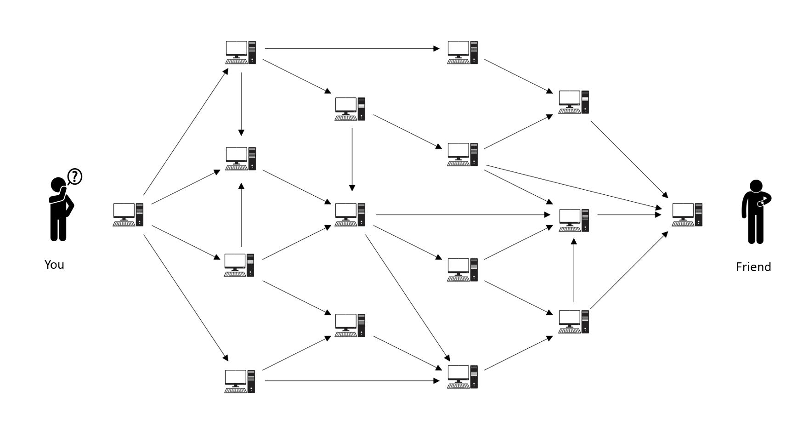
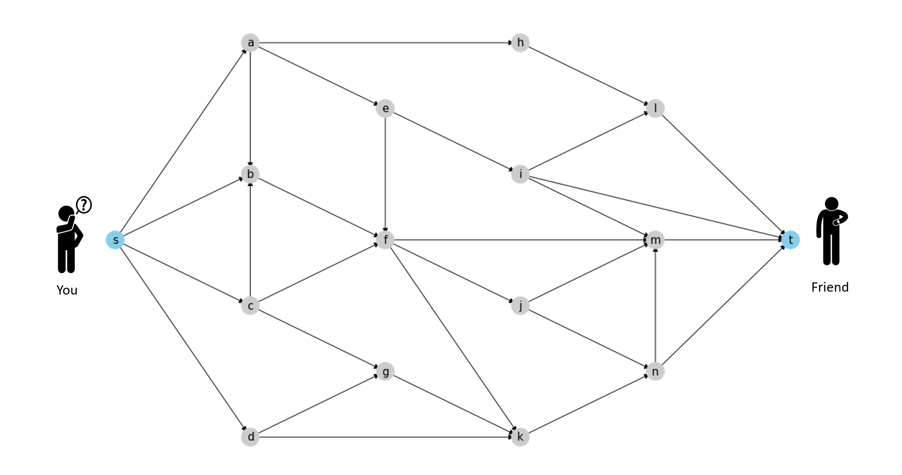
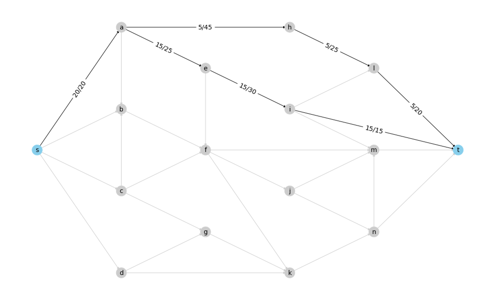
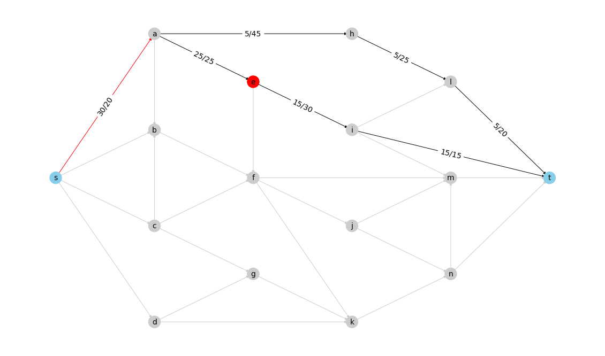

---
jupytext:
  notebook_metadata_filter: all
  text_representation:
    extension: .md
    format_name: myst
    format_version: 0.13
    jupytext_version: 1.11.2
kernelspec:
  display_name: Python 3
  language: python
  name: python3
language_info:
  codemirror_mode:
    name: ipython
    version: 3
  file_extension: .py
  mimetype: text/x-python
  name: python
  nbconvert_exporter: python
  pygments_lexer: ipython3
  version: 3.8.5
---

- [ ] find good example of biparted matching and apply algorithm on it and plot the maxflow - code + graphs
- [ ] refine the wording

+++

# Tutorial: Dinitz's algorithm and its applications

In this tutorial, we will introduce [Maximum flow problem](https://en.wikipedia.org/wiki/Maximum_flow_problem) and [Dinitz's algorithm](https://en.wikipedia.org/wiki/Dinic%27s_algorithm) [^1], which is implimented at [algorithms/flow/dinitz_alg.py](https://github.com/networkx/networkx/blob/main/networkx/algorithms/flow/dinitz_alg.py) in NetworkX. We will also see how it can be used to solve some interesting problems.

## Maximum flow problem

### Motivation
Let's say you want to send your friend some data as soon as possible, but the only way of communication/sending data between you two is through a peer-to-peer network. An interesting thing about this peer-to-peer network is that it allows you to send data along the paths you specify with certain limits on the sizes of data per second that you can send between a pair of nodes in this network. 



So how shall you plan the paths of the data packets to send them in the least amount of time?

Note that here we can divide the data into small data packets and send it across the network and the receiver will be able to rearrange the data packets to reconstruct the original data.

### Formalization
So how can we model this problem in terms of graphs?

Let's say $N=(V, E)$ represents this peer-to-peer network with $V$ as the set of nodes where nodes are computers and $E$ as the set of edges where edge $uv \in E$ if there is a connection from node $u$ to node $v$ across which we can send data. There are also 2 special nodes first one is the one on which you are there, call it $s$ & the second being the one with your friend call it $t$. We also name them ***source*** and ***sink*** nodes respectively. 



Now say that node $u$ and node $v$ are connected and the maximum data per second that you can send from node $u$ to node $v$ is $c_{uv}$, lets call this as capacity of the edge $uv$.


So before go ahead and plan the paths on which we will be sending the data packets, we need some way to represent or plan on the network. Observe that any plan will have to take up some capacity of the edges, so we can represent the plan by the values of the capacity taken by it for each edge in E, let's call the plan as **flow**.Formally, we can define flow as $f: E \to \mathbb{R}$ i.e. a mapping from edges $E$ to real numbers denoting that we are sending data at rate $f(uv)$ through edge $uv\in E$. 

Note that for this plan to be a valid plan it must satisfy the following constraints
* **Capacity constraint:**
    The data rate at which we are sending data from any node doesn't exceed its capacity, formally $f_{uv} \le c_{uv}$
* **Conservation of flow:**
    Rate at which data is sent to a node is same as the rate at which the node is sending data to other nodes, except for the source $s$ and sink $t$ nodes. Formally $\sum\limits_{u|(u,v) \in E}f_{u,v} = \sum\limits_{w|(v,w) \in E}f_{v,w} $ for $v\in V\backslash \{s,t\}$
   
example of valid flow:


example of invalid flow:


red color edges have capacities overflowed and red color nodes dont satisfy the conservation of flow 

*So if we use this plan/flow to send data then at what rate will we be sending the data to friend?* 

To answer it we need to observe that any data that the sink node $t$ will receive will be from its neighbors so if we sum over the data rates from plan/flow from those neighbors to the sink node we shall get the total data rate at which $t$ will be receiving the data. Formally we can say that the **value of the flow** is $|f|=\sum\limits_{u|(u,t) \in E}f_{u,t}$. Also note that since flow is conservative $|f|$ would also be equal to $\sum\limits_{u|(s,u) \in E}f_{s,u}$. 

Remember our goal was to maximize the rate at which the data is being sent to our friend, which is the same as maximizing the flow value $|f|$. 

This is the definition of the **Maximum Flow Problem**.
 
## Dinitz's algorithm

Before understanding how Dinitz's algorithm works and its steps let's define some terms.

#### Residual Capacity & Graph
If we send $f_{uv}$ flow through edge $uv$ with capacity $c_{uv}$, then we define residual capacity by $g_{uv}=c_{uv}-f_{uv}$ and residual network by $N'$ which only considers the edges of $N$ if they have non-zero residual capacity.


#### Level Network

The level network is a subgraph of the residual network which we get when we apply [BFS](https://en.wikipedia.org/wiki/Breadth-first_search) from source node $s$ to divide the nodes into levels and only consider the edges to be in the level network $L$ which connect nodes of 2 different levels.


Note that if sink node $t$ is not reachable from the source node $s$ that means that no more flow can be pushed through the residual network.

#### augmenting path & flow

An augmenting path $P$ is a path from source node $s$ to sink node $t$ such that all the edges on the path have positive residual capacity i.e. $g_{uv}>0$ for $uv \in P$

and augmenting flow $\alpha$ for that path $P$ is the minimum value of the residual flow across all the edges of $P$. i.e. $\alpha = min\{g_{uv}, uv \in P\}$.

And by augmenting the flow along path $P$ we mean that reduce the residual capacities of the edges in path $P$ by $\alpha$ which will leave atleast one of the edges on the residual network with zero residual capacity.

We find augmenting paths by applying [DFS](https://en.wikipedia.org/wiki/Depth-first_search) on the Level network $L$.


#### Algorithm

1. Initialize flow with zero value, $f_{uv}=0$
2. Construct a residual network  $N'$ form that flow
3. Find level network $L$ using BFS, if $t$ not there is a level network then break and output the flow
4. Find augmenting path $P$ in level network $L$
5. Augment the flow along the edges of path $P$ which will give a new residual network
6. Repeat from point 3 with new residual network

```{code-cell} ipython3
%matplotlib inline
import networkx as nx
import matplotlib.pyplot as plt
import pickle
import copy
import random
```

```{code-cell} ipython3
gname = "egnetwork"
# loading the graph
G = nx.read_graphml(f"data/{gname}.graphml")
with open(f"data/pos_{gname}", "rb") as fp:
    pos = pickle.load(fp)
```

```{code-cell} ipython3
fig, axes = plt.subplots(4, 2, figsize=(20, 30))

# assign colors and labels to nodes based on their type
color_map = {'t':'lightgreen','s':'salmon'}
node_colors = [ color_map[u] if u in color_map.keys() else '0.8'  for u in G.nodes]
node_labels = {u:u for u in G.nodes}
cutoff_list = [5,10,15,20,25,30,35,40]

for i in range(8):

    # calculating the maximum flow with the cutoff value
    R = nx.flow.dinitz(G,s='s',t='t',capacity='capacity',cutoff=cutoff_list[i])
    
    # coloring and labeling edges depending on if they have non-zero flow value or not
    edge_colors = ['0.8' if R[u][v]['flow'] == 0 else '0' for u, v in G.edges]
    edge_labels = {(u,v):f"{R[u][v]['flow']}/{G[u][v]['capacity']}"  for u,v in G.edges if R[u][v]['flow'] != 0}
    
    # drawing the network
    nx.draw_networkx_nodes(G, pos=pos, ax=axes[i // 2][i % 2], node_size=500, node_color=node_colors)
    nx.draw_networkx_labels(G, pos=pos, ax=axes[i // 2][i % 2],labels=node_labels, font_size=14)
    nx.draw_networkx_edges(G, pos=pos, ax=axes[i // 2][i % 2], edge_color=edge_colors)
    nx.draw_networkx_edge_labels(G, pos=pos, ax=axes[i // 2][i % 2], edge_labels=edge_labels,font_size=14)
    axes[i // 2][i % 2].set_title(f"Max Flow = {R.graph['flow_value']}\nCutoff value of = {cutoff_list[i]}",size=15)

fig.tight_layout()
```

## Reductions and Applications

There are many other problems which can be reduced to Maximum flow problem for eg.
* [Maximum Bipartite Matching](https://en.wikipedia.org/wiki/Matching_(graph_theory))
* [Assignment Problem](https://en.wikipedia.org/wiki/Assignment_problem) 
* [Transportation Problem](https://en.wikipedia.org/wiki/Transportation_theory_(mathematics))

and many others

Lets see how we can reduce the Maximum Biparted Matching to Maximum Flow Problem and retrieve the solution of Maximum Biparted Matching from solution of Maximum Flow Problem.

Note that even though dinitz works in $O(n^2m)$ strongly polynomial time, i.e. to say it doesn't depend on the value of flow. It is noteworthy that its performance of biparted graphs is especially fast being $O(\sqrt n m)$ time, where $n = |V|$ & $m = |E|$.

```{code-cell} ipython3

```

[^1]: Dinitz' Algorithm: The Original Version and Even's Version. 2006. Yefim Dinitz. In Theoretical Computer Science. Lecture Notes in Computer Science. Volume 3895. pp 218-240. <https://doi.org/10.1007/11685654_10>
[^2]:
