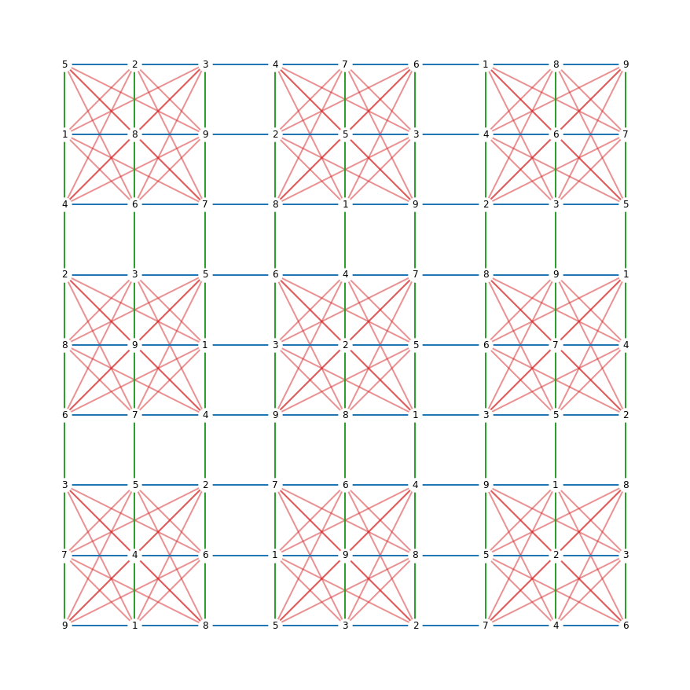
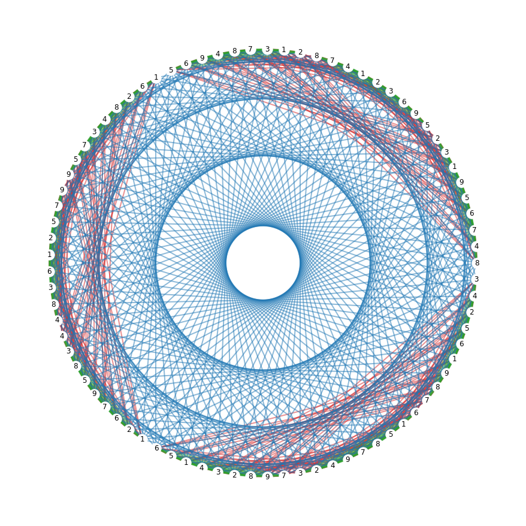
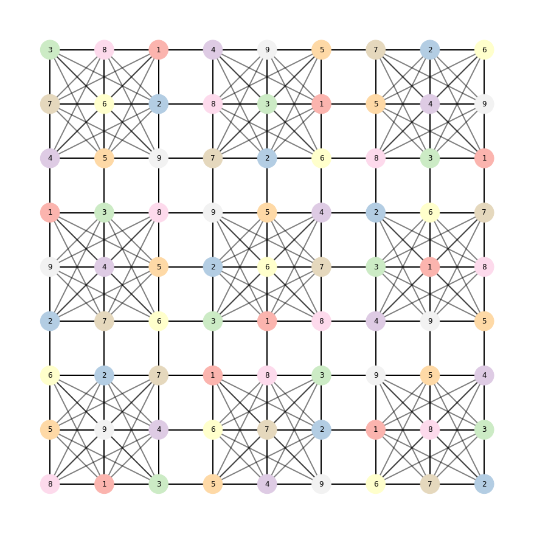

# Sudoku and Graph coloring 

This notebook tries to help you understand the mathematics in the backdrop of the popular number placement puzzle -Sudoku. A Sudoku puzzle consists of a 9 × 9 grid of 81 cells. The objective is to fill the rest of the grid with digits from 1 to 9 such that no digit repeats within any row, column and specified 3 × 3 blocks.


```python
import networkx as nx
import numpy as np
import matplotlib as mpl
import matplotlib.pyplot as plt
from random import sample
```

Informally the Sudoku graph is an undirected graph- its vertices represent the cells and edges represent pairs of cells that belong to the same row, column, or block of the puzzle. Formally this can be defined as:

> A Sudoku grid of rank $n$ is a $n^2 × n^2$ grid($X_n$) . It consists of $n^2$ disjoint $n × n$ grids. Graph of $X_n$, denoted as $GX_n$, is $(V, E)$ where cells of Sudoku grid form the vertices of its graph and two
cells are adjacent if they are either in the same row or column or block of $X_n$. 

> $GX_n$ is a regular $(n^4, \frac{3n^6}{2} − n^5− \frac{n^4}{2})$ graph of degree $3n^2 − 2n − 1$  (1)

Lala, C. "Graph theory of Sudoku." (2013).

Now, from (1) we can get that the graph of a Sudoku grid of rank 3 is a (81, 810) regular graph of degree 20. This can be verified informally- we have 81 cells in the standard sudoku where every cell is adjacent to 8 cells in its row + 8 cells in its column and 4 more leftover cells in its block, hence the degree 20.

Let's generate a random (filled) sudoku of rank n and then build further intuition


```python
def generate_random_sudoku(n):
    rank  = n
    side  = rank*rank
    def pattern(row,col): return (rank*(row%rank)+row//rank+col)%side
    def shuffle(s): return sample(s,len(s)) 
    # generate random row and column indices
    rows  = [ x*rank + row for x in shuffle(range(rank)) for row in shuffle(range(rank)) ] 
    cols  = [ x*rank + col for x in shuffle(range(rank)) for col in shuffle(range(rank)) ]
    
    numbers  = shuffle(range(1,rank*rank+1))

    board = [ [numbers[pattern(row,col)] for col in cols] for row in rows ]
    board = np.asarray(board)
    return board

# Now we want to create the structure of a sudoku graph which we can fill up with the random grid we generated.
# Note how we store the three different kinds of edges separately, this will be useful for visualization
def empty_sudoku_graph(n):
    blank_board = np.arange(n*n*n*n).reshape(n*n,n*n)
    def get_edges(nodes):
        edges = [(a, b) for idx, a in enumerate(nodes) for b in nodes[idx + 1:]]
        return edges
    box_edges=[]
    row_edges=[]
    column_edges=[]
    for iteration in range(n*n):
        i = iteration//n
        j = iteration%n
        column = np.asarray(blank_board)[:,iteration]
        row = np.asarray(blank_board)[iteration,:]
        box=blank_board[(i)*n:(i+1)*n,(j)*n:(j+1)*n].flatten()
        box_edges += get_edges(box)
        row_edges += get_edges(row)
        column_edges += get_edges(column)
    return box_edges, row_edges, column_edges

# We have the edges and the nodes, now we want a networkx graph 
def draw_networkx_graph(n, board, box_edges, row_edges, column_edges, layout='grid'):
    G = nx.empty_graph(n*n*n*n)
    if layout=='circular':
        pos=nx.circular_layout(G)
    if layout=='spring':
        pos=nx.spring_layout(G)
    if layout=='grid':
        pos = dict(zip(list(G.nodes()), nx.grid_2d_graph(n*n,n*n)))
        
    mapping = dict(zip(G.nodes(), board.flatten()))
    plt.figure(1,figsize=(12,12)) 
    nx.draw(G, pos, labels=mapping, with_labels=True, node_color='white')
    nx.draw_networkx_edges(G,pos,edgelist=box_edges,width=2, alpha=0.5, edge_color="tab:red")
    nx.draw_networkx_edges(G,pos,edgelist=row_edges,width=2, alpha=0.5, edge_color="tab:green")
    nx.draw_networkx_edges(G,pos,edgelist=column_edges,width=2, alpha=0.5, edge_color="tab:blue")
    plt.show()
    
```


```python
def sudoku(n, layout):
    board = generate_random_sudoku(n)
    box_edges, row_edges, column_edges = empty_sudoku_graph(n)
    draw_networkx_graph(n, board, box_edges, row_edges, column_edges, layout)
```

in this view we can see th three different edge colors as the three different ways two nodes can be adjacent in a sudoku graph. Observe that no edge connects the same two numbers, this is what it means to satisfy the constraints of a sudoku problem


```python
sudoku(3, 'grid')
```


    

    


We couldn't see a lot of edges in the first figure because they fell on top of each other, this is perhaps a better view, if you want to look at this in an animated way, check [this old reddit post](https://reddit.com/r/dataisbeautiful?utm_content=subreddit&utm_medium=post_embed&utm_name=8775be457c4149bd9d15290fa5723658&utm_source=embedly&utm_term=6ty4vf) although the code isn't available there and it's an old link. This is a simpler way to do it in networkx


```python
sudoku(3, 'circular')
```


    

    


Is this the only way? can we do something more? yes! we can color the vertices and not edges, it's the same problem regardless.

> A k-coloring of a graph G is a vertex coloring that is an assignment of one of k possible colors to each vertex of G (i.e., a vertex coloring) such that no two adjacent vertices receive the same color.

How many colors would we need in this case? 9 

Note: this is more than intuition, formally 9 is the chromatic number of a 2-distant coloring problem, you can learn more about it [here](https://mast.queensu.ca/~murty/sudoku-ams.pdf) !

Let's visualize this, we'll modify the drawing a little


```python
#structure of the graph remains the same!
n = 3
board = generate_random_sudoku(n)
box_edges, row_edges, column_edges = empty_sudoku_graph(3)
G = nx.empty_graph(n*n*n*n)
pos = dict(zip(list(G.nodes()), nx.grid_2d_graph(n*n,n*n)))

# we map the nodes 1-9 to a colormap
mapping = dict(zip(G.nodes(), board.flatten()))
low, *_, high = sorted(mapping.values())
norm = mpl.colors.Normalize(vmin=low, vmax=high, clip=True)
mapper = mpl.cm.ScalarMappable(norm=norm, cmap=mpl.cm.Pastel1)

plt.figure(1,figsize=(12,12)) 
nx.draw(G, pos, labels=mapping,node_size=1000, 
        node_color=[mapper.to_rgba(i) for i in mapping.values()], 
        with_labels=True)
#edges remain uncolored for the sake of visualization
nx.draw_networkx_edges(G,pos,edgelist=box_edges+row_edges+column_edges,width=2, alpha=0.5, )
plt.show()
```


    

    

