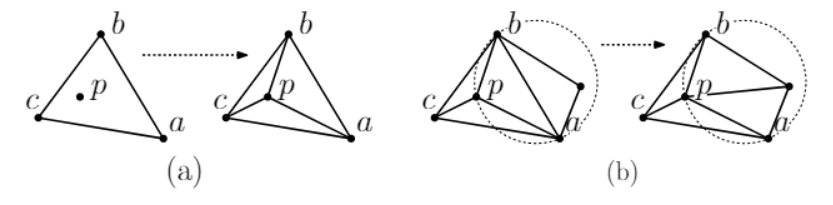

---
jupytext:
  text_representation:
    extension: .md
    format_name: myst
    format_version: 0.13
    jupytext_version: 1.13.8
kernelspec:
  display_name: Python 3 (ipykernel)
  language: python
  name: python3
---

# Delaunay Graph from Geographic Points

Delaunay triangulation for a set P of points in the plane is a triangulation DT(P) such that no point in P is inside the circumcircle of any triangle in DT(P). Delaunay triangulations maximize the minimum angle of all the angles of the triangles in the triangulation; they tend to avoid skinny triangles. The triangulation was invented by Boris Delaunay in 1934.


## Properties of Denaulay Triangulation

- Empty Circle Property of Triangles: the circumcircle of $\Delta pqr$ does not contain any other site of $P$.
- Empty Circle Property of Edges: A pair $(p_i, p_j)$ is an edge of DT if and only if there exists an empty circle passing through $p_i, p_j$.
- Closest Pair Property: Given a point set $P$, if $p_i, p_j$ are the two closest pair of points, then $(p_i, p_j)$ is an edge of DT.
- Minimum Spanning Tree: Another nice property of DT is that the minimum spanning tree of the sites is a subgraph of DT.
- Maximizing the Minimum Angle: In the plane, the Delaunay triangulation maximizes the minimum angle. Compared to any other triangulation of the points, the smallest angle in the Delaunay triangulation is at least as large as the smallest angle in any other. However, the Delaunay triangulation does not necessarily minimize the maximum angle.
- A circle circumscribing any Delaunay triangle does not contain any other input points in its interior.
- In the plane, each vertex has on average six surrounding triangles.

## Visual Delaunay definition: Flipping


From the above properties an important feature arises: Looking at two triangles **ABD** and **BCD** with the common edge BD (see figures), if the sum of the angles $\alpha$ and  $\gamma$ is less than or equal to $180^{\circ}$, the triangles meet the Delaunay condition.

This is an important property because it allows the use of a flipping technique. If two triangles do not meet the Delaunay condition, switching the common edge BD for the common edge AC produces two triangles that do meet the Delaunay condition.


## Algorithms

In two dimensions, one way to detect if point D lies in the circumcircle of A, B, C is to evaluate the determinant:

$$
\begin{bmatrix}
A_x & A_y & A_x^2 + A_y^2 & 1 \\
B_x & B_y & B_x^2 + B_y^2 & 1 \\
C_x & C_y & C_x^2 + C_y^2 & 1 \\
D_x & D_y & D_x^2 + D_y^2 & 1 
\end{bmatrix}
= 
\begin{bmatrix}
A_x - D_x & A_y - D_y & (A_x^2 - D_x^2) + (A_y^2 - D_y^2) \\
B_x - D_x & B_y - D_y & (B_x^2 - D_x^2) + (B_y^2 - D_y^2) \\
C_x - D_x & C_y - D_y & (C_x^2 - D_x^2) + (C_y^2 - D_y^2) 
\end{bmatrix}
> 0
$$

Assuming A, B and C to lie counter-clockwise, this is positive if and only if D lies in the circumcircle.

### Flip Algorithms

As mentioned above, if a triangle is non-Delaunay, we can flip one of its edges. This leads to a straightforward algorithm: construct any triangulation of the points, and then flip edges until no triangle is non-Delaunay. Unfortunately, this can take $O(n^2)$ edge flips, and does not extend to three dimensions or higher.

### Incremental

The most straightforward way of efficiently computing the Delaunay triangulation is to repeatedly add one vertex at a time, retriangulating the affected parts of the graph. When a vertex $p$ is added (Fig.a), we split in three the triangle that contains $p$, then we apply the flip algorithm (Fig.b). Done naively, this will take $O(n)$ time: we search through all the triangles to find the one that contains $p$, then we potentially flip away every triangle. Then the overall runtime is $O(n^2)$.




### Divide and Conquer

In this algorithm, one recursively draws a line to split the vertices into two sets. The Delaunay triangulation is computed for each set, and then the two sets are merged along the splitting line. Using some clever tricks, the merge operation can be done in time $O(n)$, so the total running time is $O(nlogn)$.

## Applications

Connecting the centers of the circumcircles in Delaunay triangulation forms the Voronoi diagram. Voronoi diagram and the triangulations are useful in various geometrical applications.

- A point location data structure can be built on top of the Voronoi diagram in order to answer nearest neighbor queries. For example, when one wants to find the nearest hospital.
- One can also find the largest empty circle amongst a set of points, and in an enclosing polygon. For example, to build a new supermarket as far as possible from all the existing ones.
- Useful in polymer physics. It can be used to represent free volume of the polymer.
- In climatology, Voronoi diagrams are used to calculate the rainfall of an area, based on a series of point measurements. In this usage, they are generally referred to as Thiessen polygons.
- Used to study the growth patterns of forests and forest canopies, and may also be helpful in developing predictive models for forest fires.

## Delaunay Triangulation implementation

Delaunay triangles alongwith the Voronoi diagram can be implemented in python using [PySAL](https://pysal.org/). It provides a rich suite of spatial analysis algorithms.

The `voronoi_frames` method can be used to form the required operation. The following examples will show us how to build delaunay graph (with Voronoi diagrams) from a set of points.

For basic understanding, we will use a set of random points to elaborate the usage of the function and its various parameters.

- Necessary libraries are imported

```{code-cell} ipython3
from libpysal import weights, examples
from libpysal.cg.voronoi import voronoi_frames,voronoi
from shapely.geometry import Point
import matplotlib.pyplot as plt
import networkx as nx
import numpy as np
```

- Declaring the points to be plotted in delaunay graph

```{code-cell} ipython3
points = [(10.2, 5.1), (4.7, 2.2), (5.3, 5.7), (2.7, 5.3),(10.3,6.4),(4.5,7),(20,10),(0,2)]
regions, vertices = voronoi(points)
```

- Printing the regions and points of the triangulations

```{code-cell} ipython3
regions
```

```{code-cell} ipython3
vertices
```

### Visualizing the Points

The `voronoi_frames` takes in four parameters:

- **points** (array): The originator points
- **radius** (float): The distance to ‘points at infinity’ used in building voronoi cells. Default is None.
- **clip** (string): An overloaded option about how to clip the voronoi cells. Default is 'extent'.
- **tolerance** (float): The percent of map width to use to buffer the extent of the map (default: .01, or 1%).

Next, plotting the aformentioned points in a delaunay graph

```{code-cell} ipython3
region_df, point_df = voronoi_frames(points,clip='extent')
fig, ax = plt.subplots()
ax.set_title("Basic example of voronoi_frames",fontsize=12)
region_df.plot(ax=ax, color='blue',edgecolor='black', alpha=0.3)
point_df.plot(ax=ax, color='red');
```

- Plotting the graph for a radius of 5.0. Here, the radius refers to the distance to ‘points at infinity’ used in building voronoi cells. The default value of radius is `None`.

```{code-cell} ipython3
fig, ax = plt.subplots(nrows=1,ncols=2,figsize=(10,6))

region_df, point_df = voronoi_frames(points,clip='none',radius=0.0)
ax[0].set_title('Voronoi Diagram with radius value of 0.0', fontsize=12)
region_df.plot(ax=ax[0], color='blue',edgecolor='black', alpha=0.3)
point_df.plot(ax=ax[0], color='red')

region_df, point_df = voronoi_frames(points,clip='none',radius=100.0)
ax[1].set_title('Voronoi Diagram with radius value of 100.0', fontsize=12)
region_df.plot(ax=ax[1], color='blue',edgecolor='black', alpha=0.3)
point_df.plot(ax=ax[1], color='red');
```

Finally, generating graph for different clip options.The clip options available are - 
- `'none'` / `None`: No clip is applied
- `'bbox'` / `'extent'` / `'bounding box'`: Clip the voronoi cells to the bounding box of the input points
- `'chull'` / `'convex hull'`: Clip the voronoi cells to the convex hull of the input points
- `'ashape'` / `'ahull'`: Clip the voronoi cells to the tightest hull that contains all points

```{code-cell} ipython3
fig, ax = plt.subplots(nrows=2,ncols=2,figsize=(12,9))

region_df, point_df = voronoi_frames(points,clip='none')
ax[0,0].set_title('Voronoi Diagram with no clipping', fontsize=12)
region_df.plot(ax=ax[0,0], color='blue',edgecolor='black', alpha=0.3)
point_df.plot(ax=ax[0,0], color='red')

region_df, point_df = voronoi_frames(points,clip='extent')
ax[0,1].set_title('Voronoi Diagram with Bounding Box clipping', fontsize=12)
region_df.plot(ax=ax[0,1], color='blue',edgecolor='black', alpha=0.3)
point_df.plot(ax=ax[0,1], color='red')

region_df, point_df = voronoi_frames(points,100.0,clip='chull')
ax[1,0].set_title('Voronoi Diagram with Convex Hull clipping', fontsize=12)
region_df.plot(ax=ax[1,0], color='blue',edgecolor='black', alpha=0.3)
point_df.plot(ax=ax[1,0], color='red');

region_df, point_df = voronoi_frames(points,100.0,clip='ahull')
ax[1,1].set_title('Voronoi Diagram with tightest hull clipping', fontsize=12)
region_df.plot(ax=ax[1,1], color='blue',edgecolor='black', alpha=0.3)
point_df.plot(ax=ax[1,1], color='red');
```

### Voronoi Frames with Real World Dataset

This example shows how to build a delaunay graph (plus its dual, the set of Voronoi polygons) from a set of points. For this, we will use the dataset of train stations in Singapore. The methods shown here can also work directly with polygonal data using their centroids as representative points.

- First, including the necessary libraries

```{code-cell} ipython3
from libpysal import weights, examples
from libpysal.cg import voronoi_frames
from contextily import add_basemap
import matplotlib.pyplot as plt
import networkx as nx
import pandas as pd
import numpy as np
```

- Reading the dataset from a CSV file using Pandas. The dataset contains the information about each train stations in Singapore alongwith its latitude and longitudes. Next, the coordinates are converted into float data type from string

```{code-cell} ipython3
data = pd.read_csv("data/singapore_train_stations.csv")

data.lng = list(map(float, data.lng))
data.lat = list(map(float,data.lat))
```

- In order for networkx to plot the nodes of our graph correctly, we need to construct the array of coordinates for each point in our dataset. To get this as a numpy array, we extract the x and y coordinates from the geometry column.

```{code-cell} ipython3
coordinates = np.column_stack((data.lng, data.lat))
```

- While we could simply present the Delaunay graph directly, it is useful to visualize the Delaunay graph alongside the Voronoi diagram. This is because the two are intrinsically linked: the adjacency graph of the Voronoi diagram is the Delaunay graph for the set of generator points! Put simply, this means we can build the Voronoi diagram (relying on scipy.spatial for the underlying computations), and then convert these polygons quickly into the Delaunay graph. Be careful, though; our algorithm, by default, will clip the voronoi diagram to the bounding box of the point pattern. This is controlled by the "clip" argument.

```{code-cell} ipython3
cells, generators = voronoi_frames(coordinates,clip='chull')
```

- With the voronoi polygons, we can construct the adjacency graph between them using "Rook" contiguity. This represents voronoi cells as being adjacent if they share an edge/face. This is an analogue to the "von Neuman" neighborhood, or the 4 cardinal neighbors in a regular grid. The name comes from the directions a Rook piece can move on a chessboard.

```{code-cell} ipython3
delaunay = weights.Rook.from_dataframe(cells)
```

- Once the graph is built, we can convert the graphs to networkx objects using the relevant method.

```{code-cell} ipython3
delaunay_graph = delaunay.to_networkx()
```

- To plot with networkx, we need to merge the nodes back to their positions in order to plot in networkx

```{code-cell} ipython3
positions = dict(zip(delaunay_graph.nodes, coordinates))
```

- Now, we can plot with a nice basemap using Contextily

```{code-cell} ipython3
figure,ax = plt.subplots(figsize=(15, 9))
cells.plot(ax=ax,facecolor="lightblue", alpha=0.50, edgecolor="cornsilk", linewidth=2)
add_basemap(ax,crs='EPSG:4326')
ax.axis("off")
nx.draw(
    delaunay_graph,
    positions,
    ax=ax,
    node_size=2,
    node_color="k",
    edge_color="k",
    alpha=0.8,
)
plt.show()
```

## References

- [Delaunay Triangulation](http://wiki.gis.com/wiki/index.php/Delaunay_triangulation)
- [libpysal.cg.voronoi_frames](https://pysal.org/libpysal/generated/libpysal.cg.voronoi_frames.html#libpysal.cg.voronoi_frames)
- [Incremental approach](https://www.cs.umd.edu/class/spring2020/cmsc754/Lects/lect13-delaun-alg.pdf)
